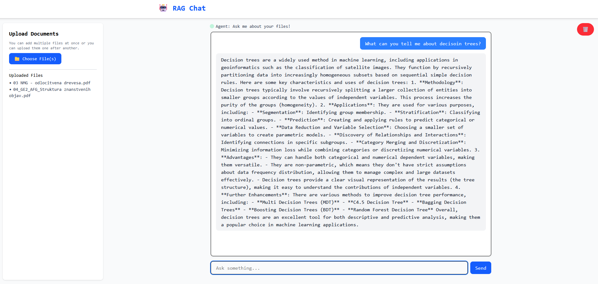

# RAG Chatbot

This is a basic RAG (Retrieval-Augmented Generation) chatbot built with React, TypeScript, and LangChain. It allows users to upload documents, which are then processed and indexed for question answering.

Live app demo: [RAG Chat](http://134.199.190.229:5173//)



The whole app is build from 3 main parts:
1. Frontend: React app that allows users to upload files and ask questions.
2. Backend: TypeScript server that handles communication with the RAG service.
3. Agent: Handling of the document processing (chunking, vectorization, etc.) and question answering.

## Quick Start
There are 2 ways to run the app. The first and the easiest is to use the Docker Compose setup, which will run all parts of the app in containers. The second way is to run each part separately.

### Using Docker Compose
1. Make sure you have Docker and Docker Compose installed.
2. Clone the repository.
3. Navigate to the project directory.
4. Prepare the `.env` file by copying the `.env.example` file.
    * Make sure to set all the required environment variables.
5. Run the following command to start the app:
   ```bash
    docker-compose up --build
    ```
6. Open your browser and go to `http://localhost:5173/`.

### Running Each Part Separately
### Prerequisites
- Node.js (v18 or higher)
- Python (v3.8 or higher)
- pip (Python package installer)
#### Not required but recommended:
- UV (Universal Virtual Environment) for Python to manage dependencies.
- NVM (Node Version Manager) to manage Node.js versions.
### Steps to Run Each Part
1. **Frontend**: Navigate to the `app` directory and run:
   ```bash
   npm install
   npm run dev
   ```
   Open your browser and go to `http://localhost:5173/`.
2. **Backend**: Navigate to the `backend` directory and run:
   ```bash
    npm install
    npm run build
    npm run start
    ```
    The backend will be available at `http://localhost:3001/`.
3. **Agent**: Navigate to the `agent` directory and run:
    * Set up the `.env` file by copying the `.env.example` file.
    ```bash
    pip install -r requirements.txt
    uvicorn main:app --reload --port 8000
    ```
    The agent will be available at `http://localhost:8000/`.


## Technologies Used
- **Frontend**
    - React, TypeScript, Tailwind CSS
    - Node version: 24.1.0
    - Vite for development server
- **Backend**:
    - TypeScript, Express.js
    - Node version: 24.1.0
- **Agent**:
    - Python version: 3.13.2
    - Model: gpt-4o-mini
    - Embeddings: OpenAIEmbeddings
    - Vector Store: ChromaDB (used with [Chroma Cloud Client](https://docs.trychroma.com/docs))
